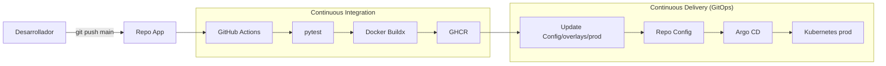

# SPRINT4_REPORT.md

**Proyecto:** MLOps GitOps — TFM UNIR  
**Sprint:** 4 — CI/CD con GitHub Actions y GHCR  
**Fecha:** 29 de junio de 2026  
**Alcance:** Pipeline automatizado App → GHCR → Config → Argo CD (sin MLflow, sin `kubectl apply`)

---

## 1. Objetivo del Sprint

Cerrar el ciclo **Continuous Integration / Continuous Delivery** conectando el repositorio de aplicación (`App`) con el repositorio GitOps (`Config`) de forma automatizada, manteniendo **Argo CD como único mecanismo de despliegue** en el clúster.

---

## 2. Arquitectura del flujo CI/CD



### Secuencia detallada

| Paso | Actor | Acción |
|---|---|---|
| 1 | Desarrollador | `git push` a `main` en `App` |
| 2 | GitHub Actions | Ejecuta `pytest` (99 tests) |
| 3 | GitHub Actions | Construye imagen con **Docker Buildx** |
| 4 | GitHub Actions | Publica en **GHCR** con tag `{short_sha}` y `run-{number}` |
| 5 | GitHub Actions | Clona `Config`, ejecuta `kustomize edit set image` |
| 6 | GitHub Actions | Commit + push a `Config/main` |
| 7 | Argo CD | Detecta cambio en Git, sincroniza `overlays/prod` |
| 8 | Kubernetes | Ejecuta **RollingUpdate** con nueva imagen |

**Restricción respetada:** en ningún paso del pipeline se ejecuta `kubectl apply`.

---

## 3. Workflow implementado

**Archivo:** [`.github/workflows/ci-cd.yml`](.github/workflows/ci-cd.yml)

### Triggers

| Evento | Rama | Jobs ejecutados |
|---|---|---|
| `pull_request` | `main` | Solo `test` |
| `push` | `main` | `test` + `build-publish-gitops` |

### Jobs

#### Job 1: `test`

- Checkout del código
- Python 3.12 con cache de pip
- Instalación de `requirements.txt` + `requirements-test.txt`
- Validación de imports (`from app.main import app`)
- `python -m pytest`

#### Job 2: `build-publish-gitops`

Condición: `push` a `main` y job `test` exitoso.

| Step | Herramienta | Descripción |
|---|---|---|
| Compute metadata | bash | Calcula `short_sha` (7 chars) e imagen GHCR |
| Docker Buildx | `docker/setup-buildx-action@v3` | Builder multi-plataforma |
| Login GHCR | `docker/login-action@v3` | Autenticación con `GITHUB_TOKEN` |
| Build & Push | `docker/build-push-action@v6` | Build con cache GHA |
| Setup Kustomize | `imranismail/setup-kustomize@v2` | v5.8.1 |
| Update GitOps | bash + kustomize | Clona Config, actualiza imagen, commit, push |

### Tags de imagen publicados

```
ghcr.io/<owner>/ai-house-predictor:<short_sha>    ← tag de despliegue (GitOps)
ghcr.io/<owner>/ai-house-predictor:run-<number>   ← tag de trazabilidad CI
```

Ejemplo:

```
ghcr.io/rcazorla766/ai-house-predictor:f643a78
ghcr.io/rcazorla766/ai-house-predictor:run-42
```

### Actualización GitOps (Kustomize)

```bash
cd config-repo/overlays/prod
kustomize edit set image "ai-house-predictor=ghcr.io/<owner>/ai-house-predictor:<short_sha>"
git commit -m "ci(app): update prod image to ghcr.io/<owner>/ai-house-predictor:<short_sha>"
git push origin main
```

Esto modifica la sección `images:` de `kustomization.yaml` de forma declarativa, **sin reemplazos manuales de texto**.

---

## 4. Cambios en el repositorio Config

| Archivo | Cambio |
|---|---|
| `overlays/prod/kustomization.yaml` | `newName: ghcr.io/rcazorla766/ai-house-predictor` |
| `overlays/prod/deployment-patch.yaml` | `imagePullPolicy: Always` para registry remoto |

**No se modificó:** `argocd/application.yaml`, estructura base, overlays dev, probes, securityContext.

---

## 5. Secretos y permisos necesarios

### Secretos en repositorio `App`

| Secreto | Obligatorio | Descripción |
|---|---|---|
| `GITHUB_TOKEN` | Automático | Push a GHCR (`packages: write`) |
| `CONFIG_REPO_TOKEN` | **Sí** | PAT fine-grained o classic con permiso `contents:write` sobre repo `Config` |

### Creación de `CONFIG_REPO_TOKEN`

1. GitHub → Settings → Developer settings → Personal access tokens
2. Crear token con scope:
   - `repo` (classic) **o**
   - Repository access: `Config` + Contents: Read and write (fine-grained)
3. Añadir en `App` → Settings → Secrets and variables → Actions → `CONFIG_REPO_TOKEN`

### Permisos del workflow

```yaml
permissions:
  contents: read
  packages: write
```

### Permisos del repositorio

- **Actions → General → Workflow permissions:** Read and write (si se requiere)
- **Packages:** visibilidad pública recomendada para TFM (evita `imagePullSecrets` en clúster local)

---

## 6. Decisiones técnicas adoptadas

| Decisión | Justificación |
|---|---|
| Separar jobs `test` y `build-publish-gitops` | Fail-fast: no publicar imagen si tests fallan |
| CD solo en `push` a `main`, no en PR | Evita despliegues desde ramas no productivas |
| Tag de despliegue = **short SHA** | Trazabilidad directa commit ↔ imagen ↔ manifiesto |
| Tag adicional `run-{number}` | Correlación con ejecución CI en GitHub Actions |
| `kustomize edit set image` | Actualización idempotente del bloque `images:` |
| Docker Buildx + cache GHA | Builds reproducibles y más rápidos |
| `concurrency` con cancel-in-progress | Evita pipelines solapados en la misma rama |
| Commit bot estándar GitHub Actions | Identificación clara de commits automatizados |
| Sin `kubectl apply` en pipeline | GitOps puro: Argo CD es el único deployer |
| `imagePullPolicy: Always` en prod | Garantiza pull de tags inmutables desde GHCR |

---

## 7. Evidencias esperadas

### 7.1 GitHub Actions (App)

```text
✓ Run Tests          — pytest: 99 passed
✓ Build, Publish     — Image pushed to ghcr.io/.../ai-house-predictor:f643a78
✓ Update GitOps      — Commit pushed to Config/main
```

### 7.2 GitHub Packages (GHCR)

Paquete visible en: `https://github.com/users/<owner>/packages/container/ai-house-predictor`

### 7.3 Repositorio Config (commit automatizado)

```text
commit: ci(app): update prod image to ghcr.io/rcazorla766/ai-house-predictor:f643a78

--- overlays/prod/kustomization.yaml
 images:
   - name: ai-house-predictor
-    newTag: "1.0.0"
+    newName: ghcr.io/rcazorla766/ai-house-predictor
+    newTag: "f643a78"
```

### 7.4 Argo CD

```text
$ kubectl -n argocd get application ai-house-predictor-prod

NAME                      SYNC STATUS   HEALTH STATUS   REVISION
ai-house-predictor-prod   Synced        Healthy         <config-commit-sha>
```

### 7.5 Kubernetes (post-sync)

```text
$ kubectl -n mlops-house-predictor-prod get deploy ai-house-predictor \
    -o jsonpath='{.spec.template.spec.containers[0].image}'

ghcr.io/rcazorla766/ai-house-predictor:f643a78
```

---

## 8. Justificación: gobernanza, trazabilidad y reducción de errores

### Gobernanza

| Antes (Sprint 3) | Ahora (Sprint 4) |
|---|---|
| Imagen construida manualmente | Imagen generada solo si tests pasan |
| Tag actualizado a mano en Config | Tag actualizado por pipeline auditado |
| Riesgo de desincronización App/Config | Single pipeline garantiza coherencia |
| Sin gate de calidad automatizado | `pytest` como quality gate obligatorio |

### Trazabilidad

Cadena completa auditable:

```
Git commit (App) → CI run #N → GHCR tag f643a78 → Git commit (Config) → Argo CD revision → Pod image
```

Cada artefacto es **inmutable** (tag SHA) y **vinculable** a un commit concreto.

### Reducción de errores de despliegue

| Error humano eliminado | Mecanismo |
|---|---|
| Desplegar código con tests rotos | Job `test` bloquea CD |
| Tag de imagen incorrecto | `kustomize edit set image` automatizado |
| Olvidar actualizar Config | Pipeline siempre actualiza GitOps |
| Deploy manual con kubectl | Prohibido; solo Argo CD sincroniza |
| Imagen stale en nodo | `imagePullPolicy: Always` en prod |

---

## 9. Problemas conocidos y requisitos del clúster

| # | Consideración | Mitigación |
|---|---|---|
| R1 | GHCR privado requiere `imagePullSecrets` en K8s | Hacer paquete público (TFM) o añadir Secret en Sprint 5 |
| R2 | `CONFIG_REPO_TOKEN` no configurado | Pipeline falla con mensaje explícito |
| R3 | Argo CD poll interval (~3 min) | Sync automático; refresh manual si necesario |
| R4 | Primera ejecución requiere secretos | Configurar secrets antes del primer push a main |

---

## 10. Configuración previa (checklist)

- [ ] Secret `CONFIG_REPO_TOKEN` creado en repo `App`
- [ ] Workflow `ci-cd.yml` en rama `main` de `App`
- [ ] Paquete GHCR con visibilidad adecuada
- [ ] Argo CD Application apuntando a `Config/overlays/prod`
- [ ] Clúster con acceso a `ghcr.io`

---

## 11. Restricciones respetadas

- ❌ No se modificó la arquitectura GitOps (Argo CD, Application, overlays)
- ❌ No se usa `kubectl apply` en el pipeline
- ❌ No se implementó MLflow (Sprint 5)
- ✅ Despliegue exclusivamente vía Argo CD al detectar cambio en Config

---

## 12. Conclusión

El Sprint 4 completa el ciclo MLOps/DevOps del TFM:

```
Código → Tests → Imagen → Registry → GitOps → Argo CD → Kubernetes
```

El pipeline CI/CD refuerza la **gobernanza de modelos de IA** al garantizar que solo artefactos validados, versionados e inmutables lleguen a producción, con trazabilidad completa desde el commit de código hasta el Pod en ejecución.

**Estado:** ✅ Implementado — pendiente de primera ejecución en GitHub Actions con secretos configurados.
